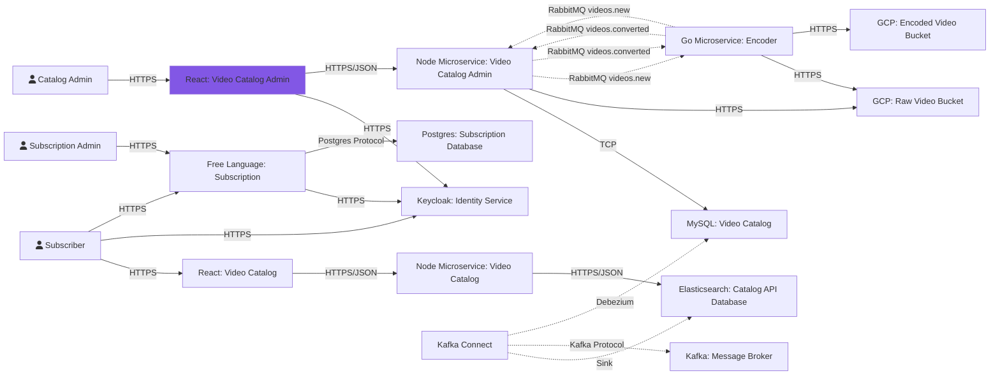

# Front-end: Video Catalog Administration
React application developed to support the administration of video catalog of the hypotetical project called Codeflix.
## Technologies
This project was developed using the following technologies:
- [Node](https://nodejs.org/en/)
- [React](https://reactjs.org/)
- [TypeScript](https://www.typescriptlang.org/)
## Pre-requisites
To run this project locally, you must install the following tools in your development environment:
- [Node](https://nodejs.org/en/)
## How to Run
To run this project, follow these steps:
1. Clone this repository
```bash
# Clone via ssh
❯ git clone git@github.com:ayrtonbsouza/codeflix-catalog-admin-web.git

# Or clone via HTTPS
❯ git clone https://github.com/ayrtonbsouza/codeflix-catalog-admin-web.git
```
2. Go to project folder
```bash
❯ cd codeflix-catalog-admin-web
```
3. Install dependencies
```bash
❯ yarn
```
4. Run the application
```bash
❯ yarn start
```
4. Wait until the project start and go to [localhost:4000](localhost:4000)
## Running Tests
To run tests, follow these steps:
1. Go to project folder
```bash
❯ cd codeflix-catalog-admin-web
```
2. Install dependencies
```bash
❯ yarn
```
3. Wait until the dependencies are installed and run the tests
```bash
❯ yarn test
```
## Concepts
This project was developed using concepts found in the following references:
- [Clean Code](https://www.amazon.com/Clean-Code-Handbook-Software-Craftsmanship/dp/0132350882)
- [Clean Architecture](https://www.amazon.com/Clean-Architecture-Craftsmans-Software-Structure/dp/0134494164/ref=sr_1_1?keywords=clean+architecture&qid=1659496918&s=books&sprefix=clean+archi%2Cstripbooks-intl-ship%2C181&sr=1-1)
- [Test Driven Development](https://www.amazon.com/Learning-Test-Driven-Development-Polyglot-Uncluttered/dp/1098106474/ref=sr_1_2?crid=KVDJAO2X3D08&keywords=test+driven+development+javascript&qid=1659496955&s=books&sprefix=test+driven+development+javascript%2Cstripbooks-intl-ship%2C163&sr=1-2)
## Architecture
This is the design of the architecture that make up the applications of the Codeflix project. The application developed in this repository is highlighted in purple.

## License
This project is licensed under the ISC License. See the [license file](LICENSE) for more information.

---
Made with ❤️ by **Ayrton Souza** :wave: [Get in touch!](https://web.whatsapp.com/send?phone=+5511941800859)
